# Employee-Password-generator

## Description

- What was your motivation? I learn alot about javascript and how make my website more professional pages 
- Why did you build this project? I build this project to generate new password for employee or users
- What problem does it solve?
1- I solved many problems like: make sure password length between 8-128 characters and should not accept number less than 8 or greater than 128 and doesn't accept string.
2- make sure the password contain at least one of the characters types Uppercase letter,lowercase letter,Numbers and special characters 
3- shows message to the user to include which type of characters they needs to generate password
4- show random password with the characters type they need.
- What did you learn? I learn javascript and how to used function,object,array and how to used the elements inside the HTML and  Class or attribute on CSS.

## Installation

N/A

## Usage
when open the webpage, there is a Botton called "Generate Password" , when click it will show the help Guide message for users and employee to know how to generate password, after that it will show a input message box ask user for password lenght between 8-128 characters, and then ask for characters type uppercase,lowercase,number and special characters 
finaly it will show the new password genarate inside the textbox in a webpage
I include some pictures for my code and webpage run.

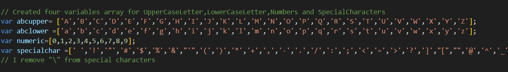
image 1: four characters variable array

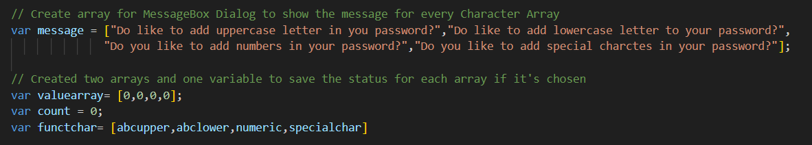
image 2: one variable array for message box and some reset values variables

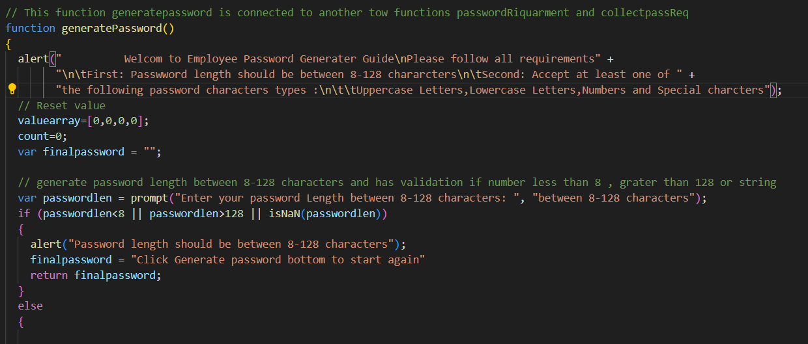
image 3:  generatepassword function and it is connect to two function image 4 and 5

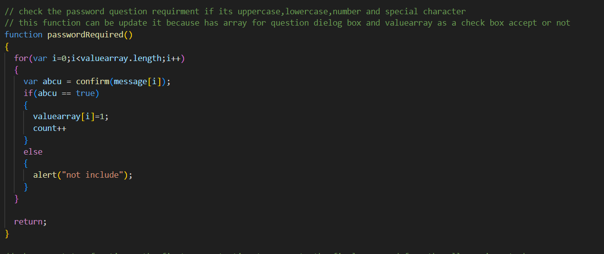
image 4: passwordRequired function

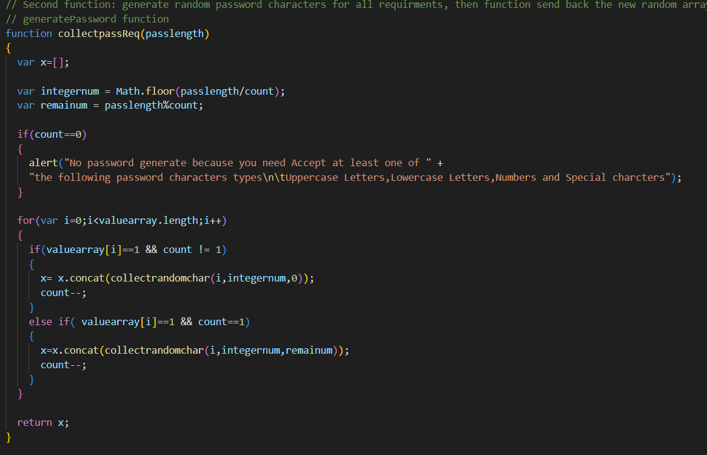
image 5: collectpassReq function

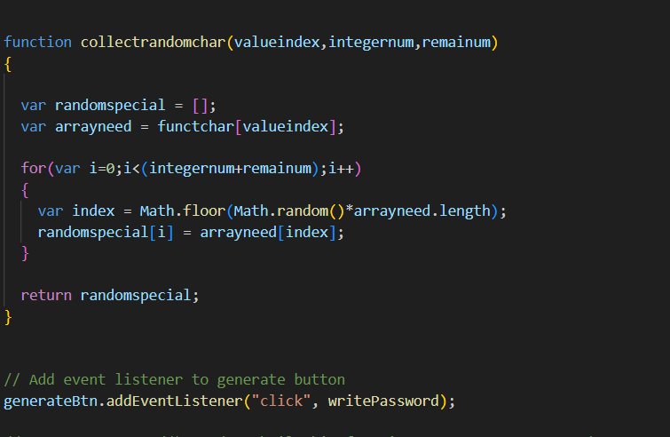
image 6: generate random array and its connect from image 5 to image 6 and then image 6 will return the result to image 5

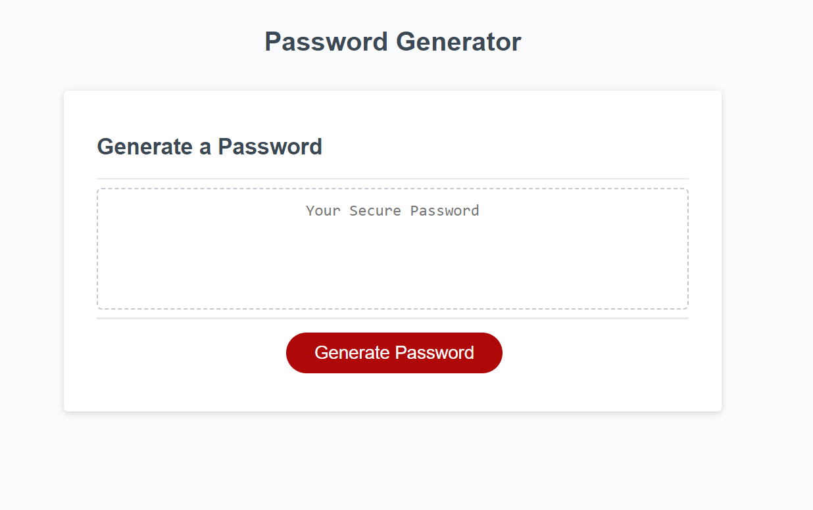
image 10: webpage - homepage

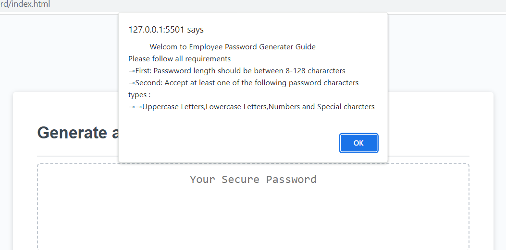
image 11: when click to the bottom show this guide message

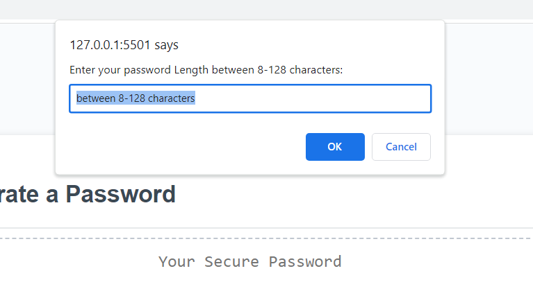
image 12: message box for enter password length

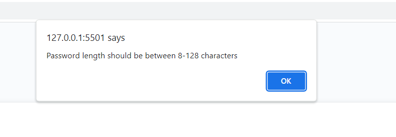
image 13: show this message if the number was less than 8 or greater than 128 or typing letters

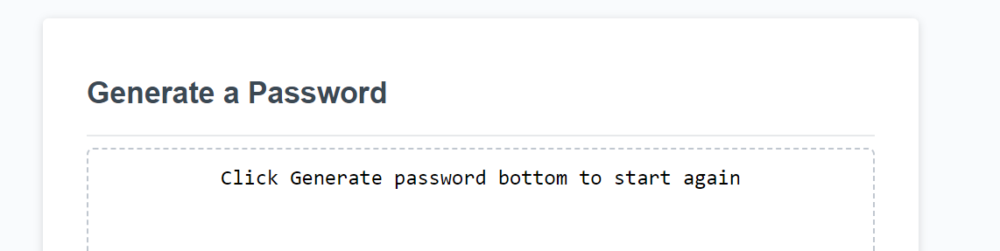
image 14: message show inside the textbox to click on the bottom again to generate password

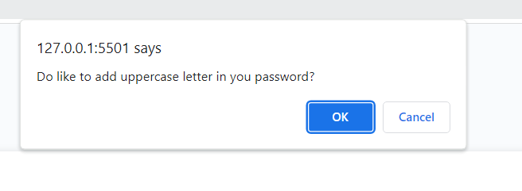
image 15: message show  to add upercase,lowercase,number and/or special characters

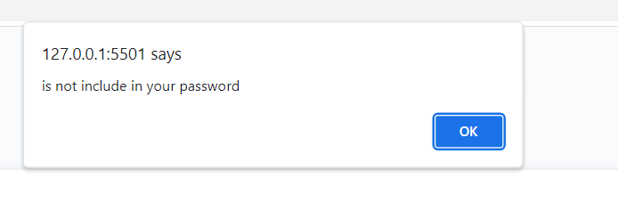
image 16: message show  when click "no" if you don't add one of the characters types

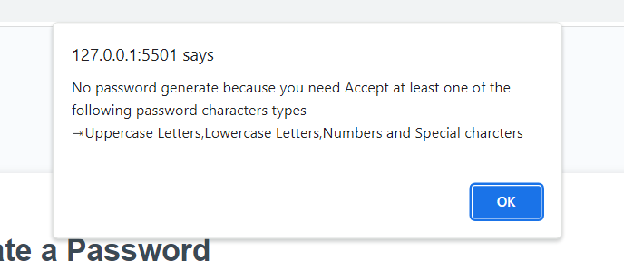
image 17: this message show  when no characters types accept it

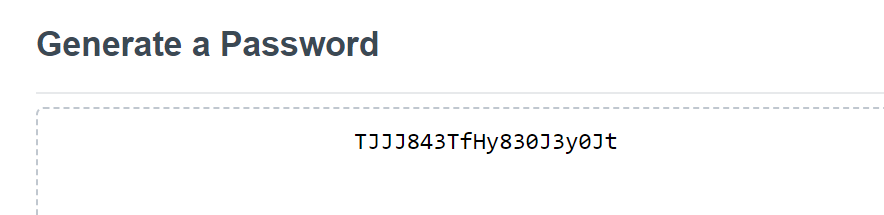
image 18: password-generated has (20characters,uppercase,lowercase,numbers)

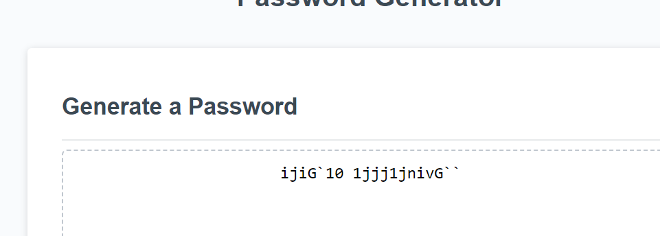
image 19: password-generated has (20characters,uppercase,lowercase,numbers and special characters)

## Credits

Thank you for tips and sugestion from Bootcamp instructors and classmates, I hava used https://www.w3schools.com/ , https://stackoverflow.com/ and https://developer.mozilla.org/en-US/docs/Web/CSS/grid-template to reserch information 

## License

Please refer to the LICENSE in the repo.